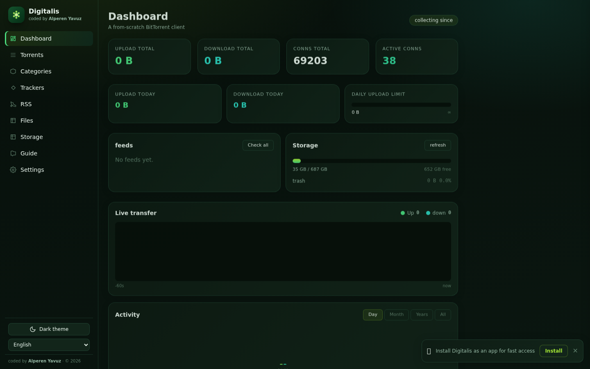

<div align="center">


# 🌸 Digitalis

> The **Yüksük Otu** — a blazing-fast BitTorrent client written **from scratch** in Go,
> with a gorgeous multilingual **digital-forest-themed** web UI.

[](https://golang.org)
[](LICENSE)
[](https://golang.org)
[-4a2740)](#-design-philosophy)

*Zero torrent libraries. Zero bloat. One beautiful binary.*



</div>

---

## 🌿 What is Digitalis?

**Digitalis** (Latin for *foxglove*, Türkçe: **Yüksük Otu**) is a self-contained
BitTorrent client built entirely from scratch in Go. No third-party torrent engine,
no Docker, no database — just a single compiled binary that speaks the BitTorrent
protocol natively and serves a beautiful, **multilingual** web dashboard.

Seed your favorite ISOs, share Linux releases, or race private torrents — Digitalis
does it all with a flower on its lapel. 🌺

---

## ✨ Features

### Core engine

| | Feature | Details |
|---|---------|---------|
| 🔄 | **Native protocol** | Tracker announce (HTTP & UDP), peer-wire protocol, bitfield — all hand-written |
| 🧲 | **Magnet metadata** | BEP-9 `ut_metadata` over BEP-10 — magnets resolve to full metadata straight from peers |
| 📡 | **DHT + PEX** | Embedded DHT node (`get_peers`/`announce`) + peer exchange between connected peers |
| 🎯 | **Rare-first picking** | Smart piece selection with streaming-priority windows |
| 👥 | **Peer list** | Live peers per torrent: IP, country, client name, progress, choke flags, ↑↓ totals |
| 🧩 | **Selective download** | Tick the files you want, untick the rest — pieces of skipped files are never fetched |
| ⏬ | **.torrent export** | Every torrent (including magnets that resolved metadata) can be exported back as a `.torrent` file |
| 🔁 | **Persistence** | Torrents, settings, statistics and RSS feeds survive restarts — no manual re-add |

### Web dashboard

| | Feature | Details |
|---|---------|---------|
| 📈 | **Live dashboard** | KPI cards, 1 Hz live transfer chart over WebSocket, activity charts (day / month / year / all) |
| 🔍 | **Torrent manager** | Instant search, state/category filters, 5 sort modes, multi-select bulk pause/resume/delete |
| 🧲 | **Drag & drop add** | Drop `.torrent` files anywhere on the page, paste a magnet — it's added |
| 🗂️ | **Categories** | Nested folders (`unix/linux/debian`) with a visual folder-creation dialog and disk targeting |
| 🤖 | **Auto-folder rules** | Regex → folder rules; a magnet lands in the right library folder the moment metadata arrives |
| 🌐 | **Multilingual UI** | **12 languages** with live switching: EN, TR, DE, FR, ES, IT, PT, RU, JA, ZH, AR, HI |
| 📖 | **Guide** | Built-in guide covering magnets, categories, settings and troubleshooting |
| 🌗 | **Dark & light theme** | Digital-forest palette, remembered per browser |
| 📱 | **PWA** | Installable web app — runs like a native app on desktop and mobile |

### Storage & automation

| | Feature | Details |
|---|---------|---------|
| 💽 | **Multi-disk storage** | Register extra storage roots; move torrents between disks and categories |
| 🛡️ | **Disk guard** | Free space below your threshold? Downloads pause automatically and resume when space recovers |
| 🗑️ | **Trash with retention** | Deleted torrents move to `.trash` and purge after N days — no more accidental data loss |
| 🚦 | **Download queue** | Cap simultaneous downloads; the rest wait and start in add order |
| 📁 | **File manager** | Browse / upload / download / mkdir / move / rename / delete across every registered disk |
| 🔗 | **Share links** | Tokenized, expiring download links for any file — perfect for LAN sharing |
| 📊 | **Disk history** | 7-day free-space trend sparkline per disk |
| 🔔 | **Telegram + Webhook** | Get notified on completion, share-goal reached or disk-guard events (ntfy.sh / Home Assistant ready) |
| 🌙 | **Night mode** | Quiet hours with rate caps or a full pause window |
| 🎯 | **Ratio & seed-day goals** | Stop or remove a torrent once it reaches its share target — global or per torrent |
| 🔐 | **Access protection** | Optional access token for the whole UI/API; media streams carry it automatically |
| 🩺 | **Port check** | One click: is your peer port reachable from the internet? |
| 💾 | **Backup / restore** | One JSON file with all settings, torrent records and RSS feeds — move hosts in minutes |

---

## 🖼️ Screenshot

The dashboard — dark digital-forest theme, live transfer chart, storage & feed panels:


---

## 📦 Installation

Only dependency for building: **Go ≥ 1.23**.

```bash
git clone https://github.com/alplix/digitalis.git
cd digitalis
go build -o digitalis ./cmd/digitalis
```

---

## 🚀 Running

```bash
./digitalis \
  --web :1919 \                    # web UI address
  --peer-port 51413 \              # incoming peer port
  --dir /mnt/torrents/downloads \  # base save directory (categories = folders under it)
  --watch /mnt/torrents/watch \    # auto-add folder (optional)
  --download-limit 0 \             # bytes/sec, 0 = unlimited
  --upload-limit 0                 # bytes/sec, 0 = unlimited
```

Then open the dashboard: **`http://YOUR-SERVER:1919/`** 🎉

> 🔓 Forward port `51413` on your router for inbound peer connections —
> the **Settings → Client → Port reachability test** button tells you instantly
> whether it worked.

---

## ⚙️ systemd (boot-persistent)

```ini
[Unit]
Description=Digitalis BitTorrent Client
Wants=network-online.target
After=network-online.target

[Service]
Type=simple
User=alp
WorkingDirectory=/home/alp/digitalis
ExecStart=/home/alp/digitalis/digitalis --web :1919 --peer-port 51413 \
          --dir /mnt/torrents/downloads --watch /mnt/torrents/watch
Restart=on-failure
RestartSec=3
LimitNOFILE=65536

[Install]
WantedBy=multi-user.target
```

```bash
sudo cp digitalis.service /etc/systemd/system/
sudo systemctl enable --now digitalis
```

---

## 🛡️ Automation & protection

Everything lives under **Settings → Automation & protection**:

- **Disk guard** — set a free-space floor in GB. When a storage root dips below it,
  all downloading torrents on *that* root pause and a badge appears on the Storage
  page. Space recovers → the queue starts them again.
- **Download queue** — `max_active_downloads` keeps only N torrents downloading;
  the rest wait (⏳ badge) and start in the order they were added.
- **Trash retention** — removed torrents land in `<root>/.trash` and are purged
  after N days (0 = delete immediately). Empty it manually per disk from the
  Storage page.
- **Telegram / Webhook** — bot token + chat id, or any webhook URL (ntfy.sh,
  Home Assistant, …). Events: download complete, share goal reached, disk guard
  engaged. Test buttons included.
- **Auto-folder rules** — case-insensitive regex → folder rules evaluated in
  order, before the built-in smart categorizer.

---

## 🔌 HTTP API

| Method | Path | Description |
|--------|------|-------------|
| `GET`   | `/api/torrents` | List all torrents + live status (queued / guard-paused flags included) |
| `GET`   | `/api/torrents/{id}` | Detail: piece map, per-file progress, health, trackers |
| `GET`   | `/api/torrents/{id}/peers` | Live peer list (IP, country, client, flags, totals) |
| `GET`   | `/api/torrents/{id}/export` | Download the torrent as a `.torrent` file |
| `GET`/`POST` | `/api/torrents/{id}/skipped` | Read / set selectively-skipped file indices |
| `POST`  | `/api/torrents` | Add: `{"source": "magnet:… / https://… / base64(.torrent)", "dir": "unix/linux", "disk": ""}` |
| `POST`  | `/api/torrents/{id}/pause` \| `resume` | Pause / resume |
| `POST`  | `/api/torrents/{id}/delete` | Remove torrent **and** its files (respects trash retention) |
| `POST`  | `/api/torrents/{id}/move` | Move to a category and/or disk: `{"category": "movies/1080p", "disk": "/mnt/disk2"}` |
| `PATCH` | `/api/torrents/{id}` | Per-torrent settings: download limit, ratio target, seed days, sequential |
| `POST`  | `/api/bulk` | `{"action": "pause"\|"resume"\|"delete", "ids": [...]}` |
| `GET`   | `/api/categories` | Category tree + torrent counts |
| `POST`/`DELETE` | `/api/categories` | Create / delete category folders |
| `GET`   | `/api/files` | Browse any storage root: `?disk=&path=` |
| `GET`   | `/api/files/download` | Download a file: `?disk=&path=` |
| `POST`  | `/api/files/upload` \| `mkdir` \| `move` \| `delete` | File-manager operations |
| `POST`  | `/api/files/share` | Create an expiring share link → `/s/{token}` |
| `GET`   | `/api/disks` | Registered roots: volume usage, content size, torrent count, trash, guard state |
| `POST`/`DELETE` | `/api/disks` | Register / remove a storage root |
| `POST`  | `/api/disks/trash/empty` | Empty the trash of one root |
| `GET`   | `/api/disk-history` | 7-day free-space trend per root |
| `GET`   | `/api/stats` | Hourly/daily/monthly/yearly traffic + country log |
| `GET`/`POST` | `/api/settings` | Rates, night mode, goals, guard, queue, trash, rules, Telegram, webhook |
| `POST`  | `/api/telegram/test` \| `/api/webhook/test` | Send a test notification |
| `GET`   | `/api/portcheck` | Public-IP + peer-port reachability test |
| `GET`/`POST` | `/api/backup` | Download / restore a full backup JSON |
| `GET`   | `/api/trackers` | Global tracker table (announces, success/fail, working) |
| `GET`/`POST`/`DELETE` | `/api/rss` | RSS feeds: add, remove, poll (`POST /api/rss/poll` = all) |
| `GET`   | `/ws` | WebSocket: 1 Hz live ticks + completion/metadata notices |

All endpoints accept `Authorization: Bearer <token>` (or `?token=`) when access
protection is enabled.

---

## 🏗️ Architecture

```
digitalis/
├── bencode/    → hand-rolled bencode encoder/decoder (+ DecodePrefix for BEP-9 splices)
├── metainfo/   → .torrent parser, magnet URI, info-hash (+ raw-info extraction for ut_metadata)
├── tracker/    → HTTP/UDP tracker announce client
├── peerwire/   → peer-wire messages, handshake, BEP-10 extension enabler
├── storage/    → file layout + per-piece SHA-1 verification + selective-write awareness
├── geo/        → embedded IP→country table (generated by geo/geobuild, no network calls)
├── dht/        → self-contained UDP KRPC DHT client (get_peers/announce)
├── torrente/   → core engine
│   ├── picker.go      → rare-first piece picker with streaming window + skip mask
│   ├── selective.go   → file-level selective download (piece masks, completion semantics)
│   ├── automation.go  → disk guard, download queue, trash, auto-category rules
│   ├── peers.go       → live peer views (client fingerprinting, geolocation)
│   ├── export.go      → .torrent export from raw info dict
│   ├── extend.go      → BEP-9 ut_metadata + BEP-11 PEX
│   ├── discovery.go   → peer dialing, magnet→storage upgrade
│   ├── dhtbridge.go   → lazy DHT startup, get_peers crawl, announce loop
│   └── settings.go / stats.go / detail.go / trackers.go
├── web/        → embedded HTTP server (embed.FS) + multilingual UI
│   ├── web.go    → REST API
│   ├── disks.go  → multi-disk storage views (cached) + trash endpoints
│   ├── files.go  → file manager (list/upload/download/mkdir/move/delete)
│   ├── share.go  → tokenized expiring share links
│   ├── backup.go → full backup / restore
│   ├── telegram.go + webhook notifications
│   ├── portcheck.go → peer-port reachability test
│   ├── rss.go    → RSS/Atom auto-downloader
│   ├── persist.go → torrent records with restore
│   ├── ws.go     → WebSocket broadcast hub
│   └── templates/index.html → forest-themed Tailwind dashboard (12 languages)
└── cmd/digitalis/main.go → entrypoint, flags, watch folder
```

**Data flow**

```
.torrent/magnet ─▶ metainfo ─▶ storage (pre-allocate files, verify SHA-1)
                    │
                    ▼
                tracker ──announce──▶ peers ──▶ peerwire handshake
                    ▲                          │
                    │              bitfield / request / piece
              piece picker ◀──── engine ◀──────┘
                    └── write blocks ─▶ storage ─▶ verify ─▶ seed
```

---

## 🌍 Localization

The web UI ships with **12 languages** out of the box. A single dropdown switches
the whole interface instantly (RTL support included for Arabic). The choice is
remembered in `localStorage`.

| Language | Code | | Language | Code |
|:--------:|:----:|---|:--------:|:----:|
| English  | `en` | | Português | `pt` |
| Türkçe   | `tr` | | Русский  | `ru` |
| Deutsch  | `de` | | 日本語    | `ja` |
| Français | `fr` | | 中文      | `zh` |
| Español  | `es` | | العربية   | `ar` |
| Italiano | `it` | | हिन्दी    | `hi` |

---

## 🤍 Design Philosophy

- **From scratch** — the protocol is ours, not a wrapper around a C library.
- **Zero bloat** — no Docker, no database, no framework of the week.
- **One binary** — static, embedded UI, ready for a Raspberry Pi or a rack server.
- **Pretty as well as functional** — software should look like the flower it's named after. 🌸

---

## 🧪 Testing

```bash
go vet ./...
go test ./torrente
go build -o digitalis ./cmd/digitalis
```

Validated against **`webtorrent.io` Sintel** (129 MB, 987 pieces): full download,
SHA-1 verification, and seeding confirmed with live peers. **Magnet add** resolves
metadata over BEP-9 `ut_metadata` directly from peers, survives restarts, and seeds
the same session. Unit tests cover the scheduler (night mode, ratio/seed goals),
disk guard, download queue, trash retention and auto-category rules.

---

## 📄 License

**MIT** — do whatever you like, but let it bloom. 🌿

<div align="center">

*Made with ❤️ and a whole lot of foxglove.*

**coded by [Alperen Yavuz](https://github.com/alplix)**

</div>
